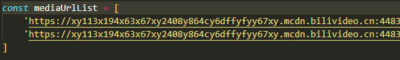
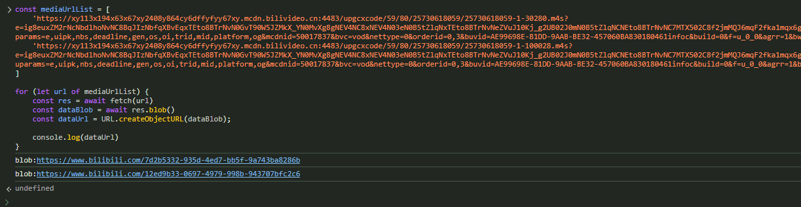

# bilibili download

using for download video and audio on `www.bilibili.com`

## Prerequire

- browser for web browse like `edge`,`chrome`,`safari`...
- `ffmpeg` or `other media encoder` to combine `m4s` file

## Usage

- open the video page on your browser for example [some video](https://www.bilibili.com/video/BV1GXqrYuE9y)

- press `F12` to open develop panel, then click the `network` menu and `refresh` the page
- 

- type `m4s` in filter input
- 

- found the links like this
- 

- `25730618059-1-30280.m4s` and `25730618059-1-100028.m4s` is the video and audio (you can use `ffmpeg` or `ffprobe` to ensure its type)

- click it and copy the `request url`
- 

- replace the url in the main.js
- 

- copy the modified code, then paste it into `console menu` in the `develop panel` and press `enter` to execute it
- 

- if your browser ban the code execution defaultly, allow it by following your browser guide

- the console will print the `blob link` when the file download finish, it may takes long time depends on your network quality
- 

- `do not close this page!!!`, and open the `two blob link` in an `new page`, then download the m4s files
- 

- combine the two m4s file by using ffmpeg or other media encoder that supports m4s
- for example: by using ffmpeg type `ffmpeg -i your_download_file_path_1.m4s -i your_download_file_path_2.m4s -c copy out.mp4` in your command line tool
- the video will be generated in current path named `out.mp4` by ffmpeg
