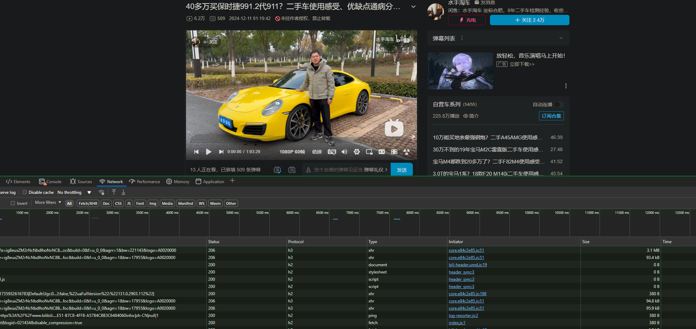
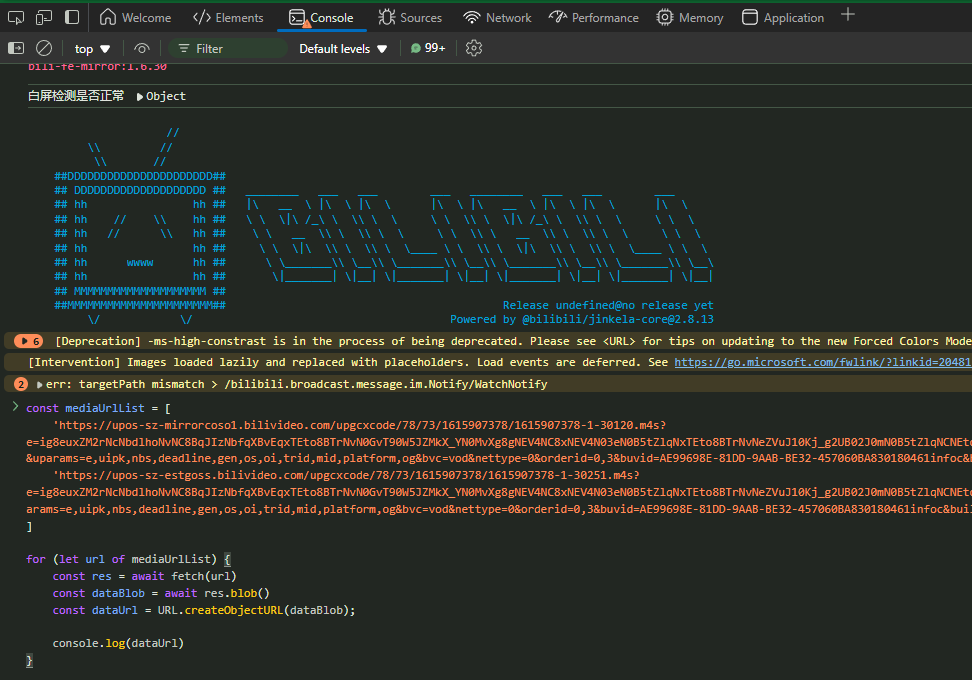
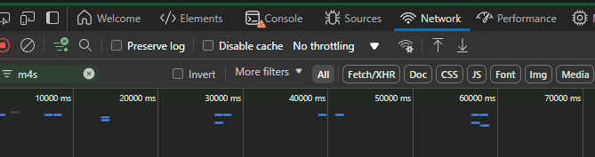
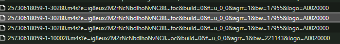
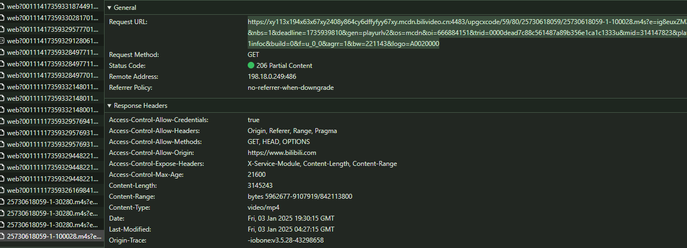

# bilibili download

using for download video and audio on `www.bilibili.com`

## Prerequire

- browser for web browse like `edge`,`chrome`,`safari`...
- `ffmpeg` or `other media encoder` to combine `m4s` file

## Usage

- open the video page on your browser [for example](https://www.bilibili.com/video/BV1GXqrYuE9y)

- press `F12` to open develop panel
- 

- copy the `main.js` code, then paste it into `console menu` in the `develop panel` and press `enter` to execute it
- 

- if your browser ban the code execution defaultly, allow it by following your browser guide

- click the `network` menu in the develop panel and `refresh` the page, remember do not close the `develop panel` until the download start

- type `m4s` in filter input
- 

- found the links like this, if you can not found the links, look at the `More filters` and select `All`
- 

- `25730618059-1-30280.m4s` and `25730618059-1-100028.m4s` is the video and audio (you can use `ffmpeg` or `ffprobe` to ensure its type after download)

- click it and copy the `request url`
- 

- type `downloadFromUrl("https://paste.request.url.here", "you_preferred_download_filename.m4s")` in the `console menu`, then press `enter` to execute it

- combine the two `m4s` file by using `ffmpeg` or other media encoder that supports `m4s`
- for example: when using ffmpeg, type `ffmpeg -i you_download_filename_1.m4s -i you_download_filename_2.m4s -c copy output_name.mp4` in your command line tool
- the video will be generated in current path named `output_name.mp4`
